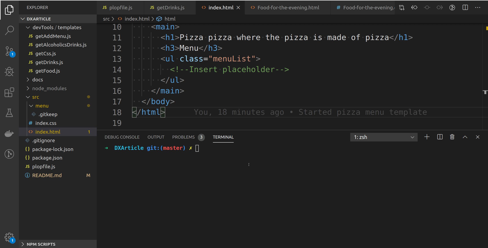

# A plop example

[plopJS](https://plopjs.com/) is a poweful node based code generator.

## Context

You are working on a pizza site that for example sake is made of an HTML and a CSS for each menu(as in a list of prices) page. It might have a lot of pages on the menu and this structure will repeat a lot.

Additionally the main HTML file menu needs to be modified.

This same patter could be applied for other examples (Each react component needs a test, a story, some hooks and so on).

## How to install

```sh
npm install
```

## How to run

```sh
npm run plop
```

## How it looks?


